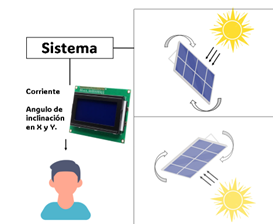

**Sistema de Seguidor Solar**

**Autores:** Jean Carlos Thome Morales, Patricio Vásquez Villarreal
**Fecha:** 11/7/2025

**1. Introducción**

Este proyecto tiene como objetivo principal desarrollar un sistema automatizado de seguimiento solar de doble eje, con el fin de maximizar la eficiencia energética de los paneles solares fotovoltaicos. El sistema está basado en el microcontrolador ESP32, que integra sensores para la intensidad de luz, servomotores y módulos de alimentación, permitiendo el ajuste dinámico de la posición del panel solar para mantenerlo alineado con la trayectoria del sol a lo largo del día. Esta solución busca brindar una alternativa económica y eficiente para aplicaciones domésticas o comerciales en el ámbito de la energía solar.

**2. Alcance y Limitaciones**

El sistema propuesto está diseñado para detectar la dirección de mayor luminosidad utilizando sensores BH1750 y ajustar automáticamente la orientación del panel solar en dos ejes, horizontal y vertical, mediante servomotores MG996R. Además, permite al usuario monitorear en tiempo real el estado del sistema a través de una pantalla LCD y una aplicación web generada desde el propio ESP32. El sistema gestiona su alimentación de manera autónoma mediante baterías recargables 18650 cargadas por energía solar, y es capaz de mostrar parámetros clave como la corriente y la orientación del panel.

Sin embargo, el diseño no contempla la integración con plataformas IoT externas como Blynk, ni el almacenamiento de datos históricos para análisis de eficiencia a largo plazo. Tampoco considera variables climáticas extremas que podrían afectar el rendimiento del seguimiento solar, lo cual limita su aplicación en entornos con condiciones meteorológicas adversas. A pesar de estas restricciones, el sistema ofrece una solución funcional y accesible para la optimización energética en instalaciones solares pequeñas.

**3. Diagrama de Contexto**

El sistema interactúa con el entorno natural (luz solar) y con el usuario. Los paneles se moverán dependiendo de la dirección del sol, la información es procesada por el Sistema para que el usuario pueda monitorear el estado del sistema a través de la pantalla LCD.

**4. Diagrama de Bloques del Diseño**

El sistema de seguidor solar se compone de varios módulos interconectados para asegurar un funcionamiento autónomo y eficiente. La energía es captada por un panel solar de 16V, cuyo voltaje es reducido mediante un módulo step-down a 5V para alimentar el controlador de carga TP4056. Este módulo gestiona la carga de las baterías de litio 18650, que a su vez alimentan el sistema cuando no hay luz solar, mediante un módulo step-up que mantiene una salida constante de 5V. El microcontrolador ESP32 actúa como el núcleo del sistema. Recibe información de los sensores de luz BH1750, y en base a esa lectura, controla el movimiento de los servomotores MG996R para orientar el panel solar. Además, recibe datos del sensor de corriente ACS712 para monitorear el consumo energético. Toda la información relevante es mostrada en una pantalla LCD, permitiendo al usuario visualizar en tiempo real el estado del sistema.

**5. Diagrama de Software o Máquina de Estados**

**6. Diseño de Interfaces**

**7. Alternativas de Diseño**

Durante la etapa de análisis, se consideraron diversas alternativas para la implementación del seguidor solar:

**Uso de BH1750 vs LDR**: Se optó por usar el sensor BH1750 para obtener una mejor precisión en la detección de la intensidad lumínica. **Microcontrolador Arduino UNO vs ESP32**: Se eligió el ESP32 por su mayor capacidad de procesamiento, conectividad WiFi/Bluetooth y compatibilidad con múltiples sensores digitales. **Seguimiento de un solo eje vs doble eje**: Aunque el seguimiento de un solo eje es más simple, se decidió implementar el doble eje para aumentar la eficiencia energética del sistema. **Pantalla LCD vs interfaz IoT**: Para mantener la simplicidad y economía del sistema, se prefirió una pantalla LCD local en lugar de una plataforma remota.

**8. Plan de Test y Validación**

Para garantizar el correcto funcionamiento del sistema, se llevarán a cabo las siguientes pruebas: **Prueba de sensores**: Verificar que los BH1750 proporcionen lecturas precisas y coherentes con las condiciones de luz ambiental. **Prueba de movimiento**: Asegurar que los servomotores respondan adecuadamente a las señales del ESP32 para posicionar el panel correctamente. **Prueba de carga**: Evaluar la eficiencia del sistema de carga del módulo TP4056 y la autonomía proporcionada por las baterías 18650. **Prueba de pantalla LCD**: Confirmar la correcta visualización de los parámetros en tiempo real. **Prueba de seguimiento: **Confirmar que el panel solar se mueve con la dirección de luz (La luz será un foco en una habitación oscura).

**9. Consideraciones Éticas**

El proyecto promueve el uso responsable de la tecnología al buscar soluciones sostenibles para la captación de energía solar. No obstante, deben considerarse los siguientes aspectos éticos:

**Impacto ambiental**: Se utilizan baterías recargables de litio; es esencial gestionarlas adecuadamente para evitar contaminación al finalizar su vida útil. **Accesibilidad**: El diseño se plantea como una solución de bajo costo para permitir su implementación en contextos rurales o con recursos limitados. **Seguridad**: Se incorporan protecciones en el sistema de carga para evitar sobrecalentamientos, cortocircuitos o daños por sobrecarga, garantizando la seguridad del usuario.

## Imágenes exportadas
Las imágenes se extrajeron del documento y se guardaron en `media/`. Inserta en el lugar apropiado:

