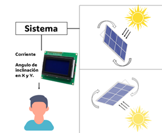
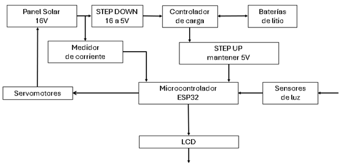
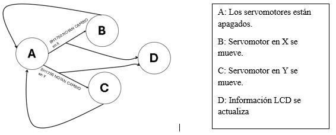
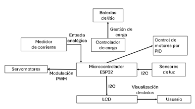

# Sistema de Seguidor Solar

**Autores:** Jean Carlos Thome Morales, Patricio Vásquez Villarreal  
**Fecha:** 01/09/2025

## 1. Introducción
Este proyecto tiene como objetivo desarrollar un sistema de seguimiento solar de doble eje, con el fin de maximizar la eficiencia energética de los paneles fotovoltaicos. El sistema está basado en el microcontrolador ESP32, que integra sensores de intensidad luminosa, servomotores y módulos de alimentación, permitiendo el ajuste dinámico de la posición del panel solar para mantenerlo alineado con la trayectoria del sol a lo largo del día. Se estima un aumento del 20–30% en captación frente a sistemas fijos, útil en hogares rurales, pequeñas industrias y sitios con alta radiación o espacio limitado.

## 2. Alcance y Limitaciones
El sistema propuesto está diseñado para detectar la dirección de mayor luminosidad con sensores BH1750 y ajustar automáticamente la orientación del panel solar en dos ejes, horizontal y vertical, mediante servomotores MG996R. Además, permite al usuario monitorear el estado del sistema mediante una pantalla LCD y una aplicación web servida por el ESP32. El sistema gestiona su alimentación autónoma con baterías recargables 18650 cargadas por energía solar, y muestra parámetros clave como la corriente y la orientación del panel, siendo adecuado para instalaciones domésticas y usos educativos o de prototipado.

Sin embargo, el diseño no contempla la integración con plataformas IoT como Blynk ni el almacenamiento de datos históricos para análisis prolongado. Tampoco considera variables climáticas extremas que podrían afectar el rendimiento del seguimiento solar, lo cual limita su aplicación en entornos con condiciones adversas. Además, el alcance actual no cubre el rango operativo de los servos, la resistencia mecánica ni pautas de mantenimiento, factores que condicionan durabilidad y escalabilidad del sistema.

## 3. Diagrama de Contexto

El sistema interactúa con el entorno natural (luz solar) y con el usuario; la información es procesada por el sistema para que el usuario pueda monitorear su estado desde la pantalla LCD (y web local).

## 4. Diagrama de Bloques del Diseño

El sistema de seguidor solar se compone de módulos interconectados que aseguran un funcionamiento autónomo y eficiente. La energía se capta con un panel solar de 16 V; su voltaje se reduce mediante un convertidor step-down a 5 V para alimentar el controlador de carga TP4056. Este dispositivo gestiona la carga de baterías de litio 18650 que, cuando no hay luz solar, abastecen el sistema a través de un convertidor step-up que mantiene una salida constante de 5 V. El microcontrolador ESP32 actúa como núcleo del sistema. Recibe lecturas de los sensores de luz BH1750 y, con base en ellas, controla el movimiento de los servomotores MG996R para orientar el panel solar. Además, incorpora la medición del sensor de corriente ACS712 para monitorear el consumo energético. Toda la información relevante se muestra en una pantalla LCD, permitiendo al usuario visualizar en tiempo real el estado general del sistema.

## 5. Diagrama de Software / Máquina de Estados

A: Los servomotores están apagados.  
B: Servomotor en X se mueve.  
C: Servomotor en Y se mueve.  
D: Información LCD se actualiza.

## 6. Diseño de Interfaces

## 7. Alternativas de Diseño
| Tema (opción elegida) | Ventajas | Desventajas |
|---|---|---|
| **Sensor: BH1750 (vs LDR)** | Mayor precisión en la detección de intensidad; lectura digital estable vía I²C; coherente con la arquitectura. | Costo y complejidad ligeramente mayores que un LDR. |
| **Microcontrolador: ESP32 (vs Arduino UNO)** | Más capacidad de procesamiento; Wi-Fi/Bluetooth integrados; compatibilidad con múltiples sensores digitales. | Configuración y consumo mayores que en UNO. |
| **Seguimiento: doble eje (vs un eje)** | Aumenta la eficiencia energética; mantiene alineación con el sol durante el día. | Mecánica y control más complejos que en un solo eje. |
| **Interfaz: LCD local (vs IoT)** | Simplicidad y economía; sin dependencia de red; menos puntos de falla. | No ofrece histórico ni monitoreo remoto propios de IoT. |

## 8. Plan de Test y Validación
Para garantizar el correcto funcionamiento del sistema, se realizarán pruebas replicables en banco: **Sensores**: con foco regulable a distancias fijas, comparar lecturas BH1750 con luxómetro y registrar cada 1 s. **Movimiento**: aplicar escalones de consigna desde el ESP32, medir tiempo de asentamiento y error angular de los MG996R. **Carga**: con fuente y carga electrónica, verificar TP4056 (régimen CC/CV) y estimar autonomía con perfiles de consumo. **LCD**: comprobar refresco y consistencia de variables frente a cambios forzados. **Seguimiento**: en habitación oscura, barrer el ángulo del foco y verificar convergencia a máxima iluminación sin oscilaciones. No se incluyen pruebas ambientales externas; las variaciones de luz y “peor caso” se reproducen de forma controlada, evitando dependencia del clima.

## 9. Consideraciones Éticas
Impacto ambiental: reciclaje responsable de baterías de litio y preferencia por materiales reciclables en la estructura. Accesibilidad: enfoque de bajo costo para contextos rurales o con recursos limitados. Seguridad: protecciones en la carga para evitar sobrecalentamientos, cortocircuitos o sobrecarga. Privacidad: si se integra IoT, proteger datos, minimizar telemetría y cifrar comunicaciones. Huella de carbono: priorizar proveedores y componentes con trazabilidad y menor impacto ambiental.
